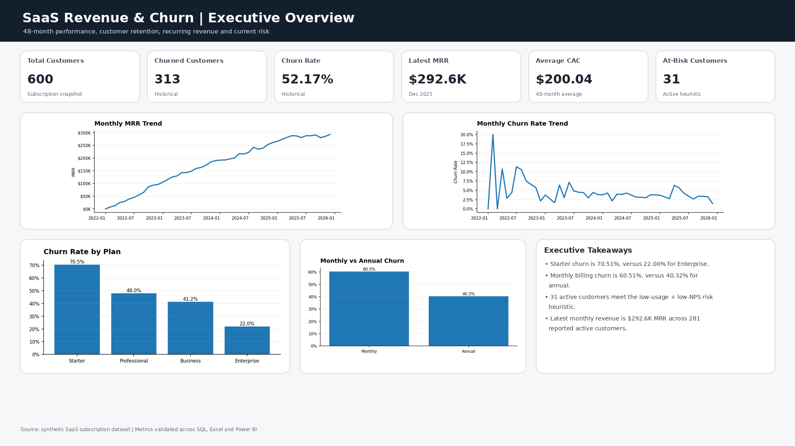
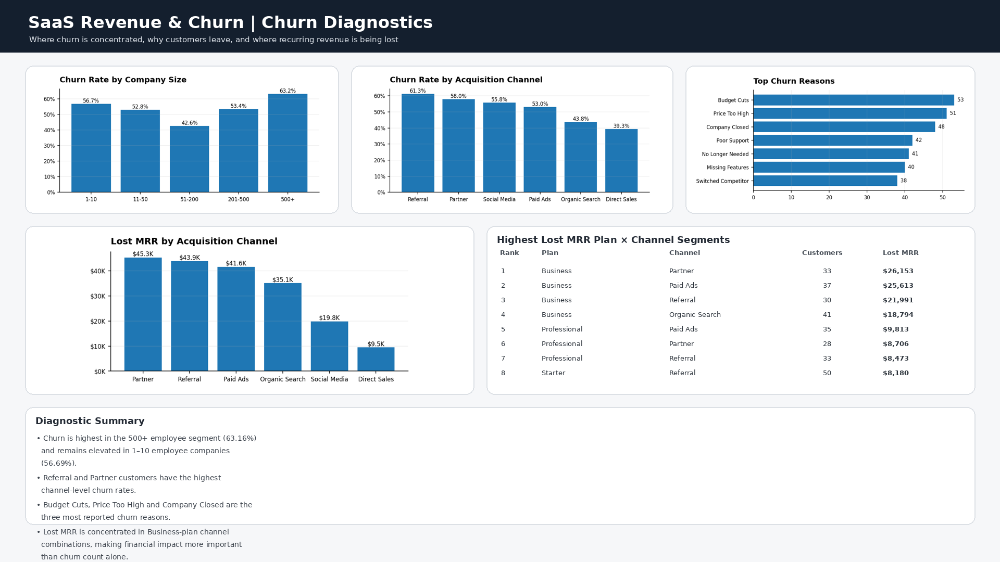
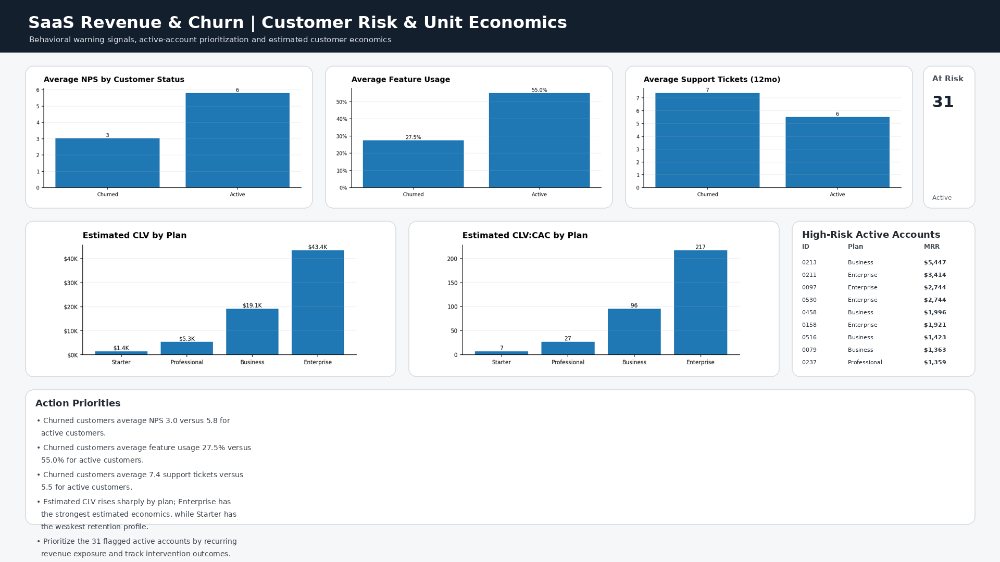

# SaaS Revenue, Churn & Customer Risk Analysis

**End-to-end analytics case study:** SQL for analysis, Excel for exploration and validation, and Power BI for executive reporting, supported by documented metric definitions, assumptions, and QA controls.



---

## Executive Summary

A SaaS business is growing revenue while experiencing significant customer churn, creating a clear retention and customer-health challenge. Across 600 subscription customers and 48 months of revenue history, **52.17% of customers have churned (313 of 600)**.

The subscription snapshot contains **287 active customers**, while the latest monthly revenue snapshot reports **281 active customers** and approximately **$292.6K in MRR**.

Churn is concentrated at the entry tier, with **Starter churn at 70.51% compared with 22.00% for Enterprise**. Customers on monthly billing also show materially higher churn at **60.51% compared with 40.32% for annual billing**.

Behavioral indicators provide an additional retention signal. Customers who churned generally show lower feature adoption and lower NPS than retained customers. A defined high-risk heuristic — active customer, feature usage below 40%, and NPS ≤ 4 — identifies **31 currently active accounts** for prioritized Customer Success review.

The recommended response is targeted: improve Starter onboarding and adoption, investigate annual-plan conversion for suitable monthly customers, prioritize outreach to high-risk active accounts, review acquisition channels generating the greatest Lost MRR, and protect high-value Enterprise accounts.

---

## Business Problem

Revenue is growing, but customer retention remains a significant business risk.

Leadership needs to understand:

- where churn is concentrated
- why customers are leaving
- which customer segments create the greatest recurring revenue loss
- which active customers show elevated retention risk
- where retention resources should be prioritized

**Stakeholders:** Product, Customer Success, Finance, Growth.

---

## Stakeholder Questions

1. What is happening to customer churn and recurring revenue?
2. Which customer segments have the highest churn?
3. Why are customers leaving?
4. Which customer segments create the greatest Lost MRR?
5. Which active customers should Customer Success prioritize?

---

## Dataset

| Source | Grain | Rows | Contents |
|---|---|---:|---|
| `data/subscriptions.csv` | One row per customer | 600 | Plan, billing cycle, industry, company size, seats, monthly revenue, acquisition channel, region, signup date, churn status/date/reason, support tickets, NPS, feature usage, upgraded |
| `data/monthly_revenue.csv` | One row per month | 48 | Active customers, new customers, churned customers, monthly churn rate, total MRR, average revenue per customer, customer acquisition cost |

Source extracts are treated as immutable. Cleaning, calculations, segmentation, and reporting are performed downstream.

Field-level documentation is available in [`docs/data_dictionary.md`](docs/data_dictionary.md).

> **Data note:** The dataset is a synthetic sample designed to represent realistic SaaS subscription behavior. The project demonstrates analytical workflow and business reasoning rather than the performance of a real company.

---

## Tools & Skills

| Layer | Tooling | Application |
|---|---|---|
| Data validation | SQL, Power Query, Excel | Null checks, duplicate checks, date validation, type validation, categorical checks |
| Analysis | MySQL | Aggregation, `CASE WHEN`, CTEs, segmentation, ranking, window functions |
| Exploration | Excel | PivotTables, trend analysis, independent KPI validation |
| Data modeling | Power BI | Date dimension, relationships, reporting model |
| Metrics | DAX | Churn, MRR, CAC, customer risk, estimated CLV, growth measures |
| Reporting | Power BI | Executive overview, churn diagnostics, customer-risk analysis |
| Governance | Markdown | Metric definitions, methodology, assumptions, QA and limitations |

---

## Data Model

A lightweight reporting model with a dedicated Date dimension:

```text
          Date
           |
          1:1
           |
    monthly_revenue


    subscriptions
    customer-level subscription snapshot
    one row per customer
```

- `Date` supports time-based analysis of monthly revenue metrics.
- `Date[Date]` is related to `monthly_revenue[month]` using single-direction filtering.
- `subscriptions` remains at customer grain and supports churn, segmentation, risk, and unit-economics analysis.
- The two source tables intentionally retain their separate analytical grains.

### Core Measures

- Total Customers
- Active Customers
- Churned Customers
- Churn Rate
- At-Risk Customers
- Lost MRR
- Latest MRR
- Average CAC
- Average Monthly Churn Rate
- Latest Active Customers
- MRR Growth
- Estimated CLV
- CLV:CAC

Measures are limited to metrics required to answer stakeholder questions.

---

## Methodology

1. Define stakeholder questions before analysis.
2. Validate customer IDs, missing values, dates, numeric fields, and categorical values.
3. Define business metrics consistently across tools.
4. Use Excel for exploratory analysis and independent validation.
5. Use SQL for segmentation, ranking, risk identification, and revenue-impact analysis.
6. Build governed DAX measures in Power BI.
7. Build reporting pages around stakeholder decisions rather than individual chart types.
8. Reconcile key metrics across Excel, SQL, and Power BI before publication.

Full definitions are documented in [`docs/methodology.md`](docs/methodology.md).

### At-Risk Customer Definition

An account is classified as high risk when:

```text
Customer is currently active
AND Feature Usage < 40%
AND NPS <= 4
```

This rule identifies **31 active customers**.

The classification is a documented business heuristic, not a predictive machine-learning model.

---

## SQL Analysis

[`sql/saas_churn_revenue_analysis.sql`](sql/saas_churn_revenue_analysis.sql) analyzes the business problem through customer segmentation, retention metrics, revenue impact, and risk prioritization.

Key analysis areas include:

- overall customer churn
- churn by subscription plan
- churn by billing cycle
- churn by company size
- acquisition-channel performance
- churn-reason analysis
- customer behavior comparison
- active customer risk identification
- plan × acquisition-channel revenue-loss analysis
- CTE-based segmentation
- window-function ranking

### Revenue Risk Analysis

A core SQL question is:

> **Which plan and acquisition-channel combinations are responsible for the greatest recurring revenue loss?**

Lost MRR is calculated for churned customers and ranked across meaningful customer segments to identify where retention problems create the greatest financial impact.

---

## Power BI Dashboard

### Page 1 — Executive Overview

**Business question:** What is happening?

Includes:

- Total Customers
- Churned Customers
- Churn Rate
- Latest MRR
- Average CAC
- At-Risk Customers
- Monthly MRR trend
- Monthly churn trend
- Churn by subscription plan
- Churn by billing cycle
- Plan, billing-cycle, and region filters

---

### Page 2 — Churn Diagnostics

**Business question:** Where and why are customers being lost?

Includes:

- churn by company size
- churn by acquisition channel
- top churn reasons
- plan × acquisition-channel analysis
- Lost MRR by customer segment



---

### Page 3 — Customer Risk & Unit Economics

**Business question:** Where should the company act?

Includes:

- feature usage and churn
- NPS and churn
- support behavior
- active high-risk customer worklist
- Estimated CLV by plan
- CLV:CAC comparison



---

## Key Findings

1. **Retention is the clearest customer-health risk identified in this analysis.**  
   313 of 600 customers have churned, producing an overall historical churn rate of **52.17%**.

2. **Churn is materially concentrated by plan tier.**  
   Starter churn is **70.51%**, compared with **22.00% for Enterprise**, making Starter the clearest retention hotspot.

3. **Billing cadence separates retention materially.**  
   Monthly customers churn at **60.51%**, compared with **40.32% for annual customers**, a difference of approximately **20.2 percentage points**.

4. **Customer adoption and satisfaction differ between churned and retained customers.**  
   Churned customers show lower feature usage and lower NPS than retained customers. These relationships are observational and do not establish causation.

5. **31 active customers meet the defined high-risk heuristic.**  
   They represent approximately **10.8% of the 287 active customers** in the subscription snapshot and remain active in that snapshot.

6. **Recurring revenue loss is concentrated by customer segment.**  
   Ranking plan × acquisition-channel combinations by Lost MRR identifies where churn creates the greatest financial impact.

7. **Enterprise retention carries disproportionate financial importance.**  
   The latest monthly revenue snapshot reports approximately **$292.6K MRR across 281 active customers**, equivalent to roughly **$1.04K MRR per reported active customer**. Enterprise accounts generate materially higher revenue per account.

---

## Recommendations

1. **Prioritize Starter onboarding and adoption.**  
   Test a structured early-life onboarding program and measure whether stronger feature adoption improves subsequent retention.

2. **Investigate monthly-to-annual conversion.**  
   Test annual-plan incentives for suitable monthly customers with healthy engagement and evaluate retention outcomes.

3. **Prioritize Customer Success outreach to the 31 high-risk accounts.**  
   Rank accounts by revenue exposure, document interventions, and measure subsequent outcomes.

4. **Review acquisition channels by Lost MRR and retention, not customer volume alone.**  
   Prioritize channels associated with high revenue loss and weak retention. Extend the analysis to channel-level CLV:CAC only when channel-level acquisition-cost data becomes available.

5. **Protect high-value Enterprise accounts.**  
   Monitor Enterprise adoption and NPS, maintain service quality, and prioritize intervention when leading indicators deteriorate.

---

## Limitations

1. The analysis is observational. Segment differences identify patterns but do not establish causal relationships.

2. The at-risk classification is a business heuristic rather than a validated predictive model.

3. Estimated CLV is directional and uses observed customer lifespan. It does not incorporate discounting, gross margin, expansion, or contraction.

4. CAC is available only as an overall monthly metric, not by individual customer, plan, or acquisition channel. Segment-level CLV:CAC therefore requires additional CAC allocation data.

5. Standard Net Revenue Retention is not calculated because expansion and contraction MRR components are unavailable.

6. Churn reasons are self-reported and may contain reporting bias.

7. The dataset is synthetic and is intended to demonstrate analytical methodology rather than real-company performance.

---

## Repository Structure

```text
saas-revenue-churn-analysis/
│
├── README.md
│
├── data/
│   ├── subscriptions.csv
│   └── monthly_revenue.csv
│
├── sql/
│   └── saas_churn_revenue_analysis.sql
│
├── excel/
│   └── saas_revenue_churn_analysis.xlsx
│
├── powerbi/
│   └── saas_churn_dashboard.pbix
│
├── screenshots/
│   ├── executive_overview.png
│   ├── churn_diagnostics.png
│   └── customer_risk_unit_economics.png
│
└── docs/
    ├── data_dictionary.md
    └── methodology.md
```

---

## How to Reproduce

1. Download or clone the repository.
2. Load `data/subscriptions.csv` and `data/monthly_revenue.csv` into MySQL.
3. Run `sql/saas_churn_revenue_analysis.sql`.
4. Review `excel/saas_revenue_churn_analysis.xlsx` for exploratory analysis and independent KPI validation.
5. Open `powerbi/saas_churn_dashboard.pbix`.
6. Refresh the data model if required.
7. Verify Power BI KPIs against the control totals below.

---

## Control Totals

| Metric | Expected Value |
|---|---:|
| Total Customers | 600 |
| Churned Customers | 313 |
| Active Customers — Subscription Snapshot | 287 |
| Overall Churn Rate | 52.17% |
| Starter Churn Rate | 70.51% |
| Enterprise Churn Rate | 22.00% |
| Monthly Billing Churn Rate | 60.51% |
| Annual Billing Churn Rate | 40.32% |
| At-Risk Active Customers | 31 |
| Latest Active Customers — Monthly Snapshot | 281 |
| Latest MRR | $292,628.61 |

Full metric definitions, assumptions, and QA rules are documented in [`docs/methodology.md`](docs/methodology.md).
